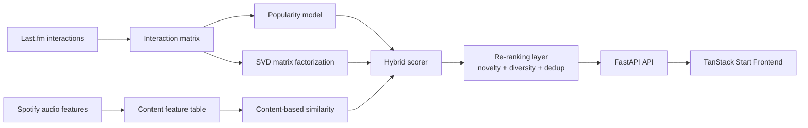

# Musify

Musify is a production-style end-to-end music recommendation system built with offline feature engineering, matrix factorization, content-based retrieval, a FastAPI serving layer, and a modern TanStack Start frontend.

It combines Last.fm 360K listening behavior with Spotify audio features to generate personalized, cold-start, and similar-artist recommendations through an interactive web interface.

## Table of Contents

- [Overview](#overview)
- [Key Features](#key-features)
- [Architecture](#architecture)
- [Tech Stack](#tech-stack)
- [Repository Structure](#repository-structure)
- [Setup](#setup)
- [Run the API](#run-the-api)
- [API Endpoints](#api-endpoints)
- [Recommendation Pipeline](#recommendation-pipeline)
- [Evaluation](#evaluation)
- [Data and Artifacts](#data-and-artifacts)
- [Why It Is Resume-Worthy](#why-it-is-resume-worthy)

## Overview

This project is an end-to-end recommendation system rather than a notebook-only prototype. The pipeline is built around precomputed artifacts and a startup routine that loads models once at application launch, which keeps inference fast and predictable.

The system is designed to solve the main recommender-system problems recruiters expect to see in real projects:

- personalized recommendations for known users
- cold-start fallback for new users
- item-to-item similarity for discovery experiences
- candidate ranking with novelty and diversity controls
- offline evaluation with standard ranking metrics

## Key Features

- Modern TanStack Start frontend integrated with the FastAPI backend
- Hybrid recommendation engine that blends popularity, SVD, and content-based signals
- FastAPI service with typed request and response schemas
- Config-driven startup through `configs/config.yaml`
- Precomputed artifacts for low-latency inference
- Final re-ranking layer for novelty, diversity, and deduplication
- Offline evaluation pipeline with ranking and catalog metrics

## Architecture



The production flow is intentionally layered:

1. Popularity handles global ranking and cold-start fallback.
2. SVD captures latent user and artist preferences.
3. Content-based similarity covers artists with audio features.
4. The hybrid scorer merges candidate pools with weighted scoring.
5. The ranker improves the final list with novelty and diversity controls.

## Tech Stack

| Area | Tools |
|---|---|
| Backend API | FastAPI, Uvicorn, Pydantic |
| Frontend | TanStack Start, React, TypeScript, Tailwind CSS |
| Data | pandas, NumPy, PyArrow |
| Modeling | SciPy, scikit-learn |
| Config | PyYAML |
| Evaluation | tqdm, custom metric utilities |

## Repository Structure

```text
Music_recommendation/
├── configs/
├── data/
├── frontend/             
│   ├── src/
│   ├── public/
│   ├── package.json
│   └── vite.config.ts
├── outputs/
├── src/
│   ├── api/
│   ├── data/
│   ├── evaluation/
│   ├── recommenders/
│   ├── features/
│   ├── models/
│   └── pipelines/
├── notebooks/
├── tests/
├── main.py
└── requirements.txt     
```

## Setup

Install dependencies from the project root:

```bash
pip install -r requirements.txt
```

Recommended Python version: 3.10 or later.

cd frontend
npm install

## Run the API

Start the service from the repository root:

```bash
uvicorn src.api.main:app --reload --host 0.0.0.0 --port 8000
```

Open the interactive documentation after startup:

- Swagger UI: http://localhost:8000/docs
- ReDoc: http://localhost:8000/redoc

The frontend connects to the FastAPI backend running at http://localhost:8000.

## API Endpoints

The FastAPI app is implemented in [src/api/main.py](src/api/main.py).

| Method | Endpoint | Purpose |
|---|---|---|
| GET | `/health` | Check service status and model load state |
| POST | `/recommend/user` | Recommend artists for a known user |
| POST | `/recommend/similar` | Find artists similar to an input artist |
| POST | `/recommend/cold-start` | Return popular artists for new users |
| GET | `/artists/{artist_name}/similar?k=10` | Browser-friendly similar-artist lookup |

### Request Contracts

- `user_id` is required for user recommendations.
- `artist_name` is required for artist similarity.
- `k` is constrained to the range 1 to 50.
- `mode` supports `hybrid`, `svd`, `content`, and `popularity`.

### Example Request

```powershell
Invoke-RestMethod -Method Post `
  -Uri "http://localhost:8000/recommend/user" `
  -ContentType "application/json" `
  -Body '{"user_id":"some_user","k":10,"mode":"hybrid"}'
```

## Recommendation Pipeline

The core recommender logic lives in [src/api/recommender.py](src/api/recommender.py) and is backed by the modules under [src/recommenders](src/recommenders).

### 1. Popularity baseline

Uses global artist popularity as the universal fallback and cold-start strategy.

### 2. SVD matrix factorization

Learns latent user and artist embeddings from the interaction matrix and returns personalized recommendations for users present in the training data.

### 3. Content-based retrieval

Builds artist similarity from Spotify audio features and can also create user profiles from listening history.

### 4. Hybrid scoring

Combines popularity, SVD, and content-based candidate pools into a single ranked candidate table.

### 5. Final reranking

Applies novelty scoring, Maximal Marginal Relevance diversity, and near-duplicate suppression before returning the final list.

## Evaluation

The evaluation workflow in [src/evaluation/evaluator.py](src/evaluation/evaluator.py) supports leave-one-out testing and standard ranking metrics.

Metrics used in the project include:

- Precision@K
- Recall@K
- MAP@K
- NDCG@K
- MRR
- Catalog coverage
- Intra-list diversity
- Novelty

This makes the project easier to defend in interviews because the model is not only implemented, but also measured with offline ranking quality signals.

## Data and Artifacts

The service loads precomputed artifacts from `data/processed` using `configs/config.yaml`.

Key assets include:

- interaction matrix and encoder artifacts
- user and artist factor matrices
- popularity table
- content feature table
- serialized SVD, content-based, hybrid, and ranker models

Dataset summary:

- Last.fm 360K: 17.5M user-artist interactions and 360K users
- Spotify Tracks: 114K tracks with audio features
- Configured sample size: 75K users


